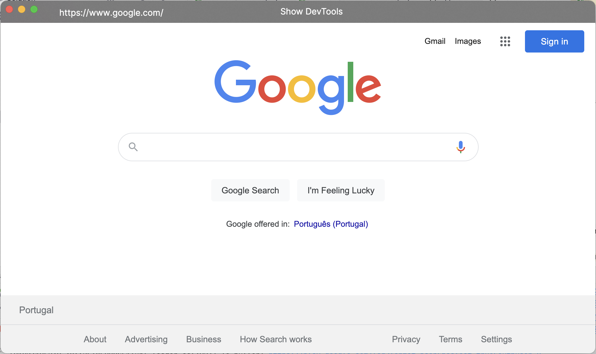

# WebView

Avalonia/WPF control that wraps CefGlue webview control

WebView lets you embed Chromium in .NET apps. It is a .NET wrapper control around [CefGlue](https://github.com/OutSystems/CefGlue) and provides a better and simple API. Likewise CefGlue it can be used from C# or any other CLR language and provides both Avalonia and WPF web browser control implementations. 

Here's a table for supported architectures, frameworks and operating systems:

| OS      | x64 | ARM64 | WPF | Avalonia |
|---------|-----|-------|-----|----------|
| Windows | ✔️  | ✔️      | ✔️   | ✔️        |
| macOS   | ✔️  | ✔️      | ❌  | ✔️        |
| Linux   | ✔️  | 🔘     | ❌  | ✔️        |

✔️ Supported | ❌ Not supported | 🔘 Works with issues.

See [LINUX.md](https://github.com/OutSystems/CefGlue/blob/main/LINUX.md) for more information about issues and tested distribution list. 
Currently only x64 and ARM64 architectures are supported.

It also provides the following additional features:
- Strongly-typed javascript evaluation: results of javascript evaluation returns the appropriate type
- Scripts are aggregated and executed in bulk for improved performance
- Ability to evaluate javascript synchronously
- Javascript error handling with call stack information
- Events to intercept and respond to resources loading
- Events to track file download progress
- Ability to load embedded resources using custom protocols
- Ability to disable history navigation
- Error handling
- Proxy configuration support
- Option to run in [offscreen rendering mode](https://bitbucket.org/chromiumembedded/cef/wiki/GeneralUsage#markdown-header-off-screen-rendering) (not recommended as it has several issues)

## Releases
Stable binaries are released on NuGet, and contain everything you need to embed Chromium in your .NET/CLR application.

## Documentation
See the [Sample](SampleWebView.Avalonia) project for example web browsers built with WebView. It demos some of the available features.

## Other
- [Avalonia FuncUI Support](https://github.com/WhiteBlackGoose/MoreFuncUI#morefuncuiwebview). 

## Versioning
The versioning system works as follows:

`<major>.<cef_version>.<patch>`

Whenever you fix a bug, please increase the patch version. \
Whenever you bring a new feature, please increase the major version. \
Use the minor version for the current cef version.

## TODO
- Improve documentation
